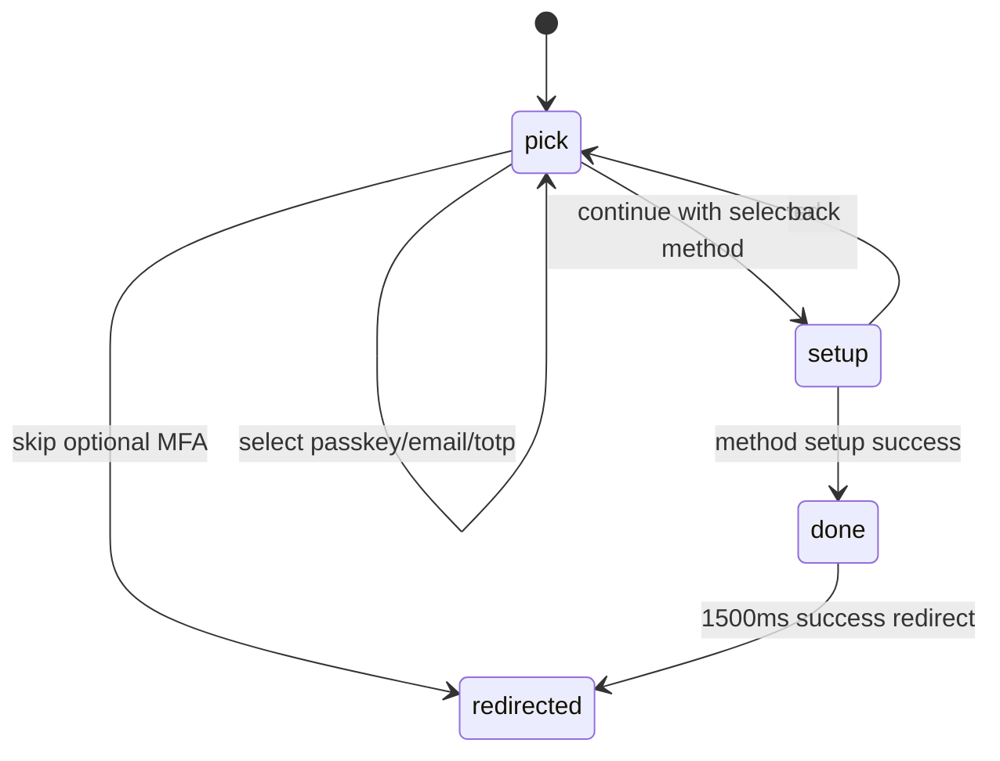

## SPEC-PORTAL-MFA-SETUP-CLEANUP-001 Progress

- Started: 2026-05-13T09:04:00+02:00
- Harness level: standard
- Development mode: tdd
- Scope: frontend-only refactor of `klai-portal/frontend/src/routes/setup/mfa.lazy.tsx`

## State Transition Map

### Route flow

Valid route states:
- `pick`: `selectedMethod` is `passkey`, `email`, `totp`, or `null`.
- `setup`: `selectedMethod` is required and selects exactly one setup component.
- `done`: success confirmation state before redirect.

### Nested setup machines

- Passkey: `idle -> loading -> idle` for user browser-dialog cancellation, `idle -> loading -> error` for failed setup, `idle -> loading -> done` for success.
- Email OTP: `send -> verify` after `/api/auth/email-otp/setup`; `verify` owns numeric code, verification loading/error, and resend cooldown.
- TOTP: `loading -> ready` after QR payload load, `loading -> error -> loading` on retry, `ready -> confirming -> done/error` on code submit.

## Implementation Notes

- Replaced 19 local `useState` slots across the route and inline components with reducer-backed state machines.
- Reduced `mfa.lazy.tsx` from 553 lines in this workspace baseline to 151 lines.
- Extracted per-method components into `setup/_components/` with `-` file prefixes so TanStack Router ignores them.
- Kept backend endpoint URLs, request bodies, redirect targets, cooldown timing, and code normalization behavior unchanged.
- Restored the email-OTP send-step visible behavior: send failures remain non-visible in that first step, matching the original UI. Verification failures remain visible in the code-entry step.

## Verification

- `npm test -- -- src/routes/setup/__tests__/-EmailOTPSetup.test.tsx src/routes/setup/__tests__/-mfa-state.test.ts`: passed, 33 files / 250 tests.
- `npm run i18n:compile`: passed.
- `npx tsc -p tsconfig.app.json --noEmit`: passed after Paraglide compilation.
- `npm test`: passed, 33 files / 250 tests.
- `npm run lint`: passed.
- `npm run build`: passed. Existing route-tree warnings remain outside `src/routes/setup`; new setup helper files are ignored through the `-` file prefix.

## Voys Tenant Smoke

- Date: 2026-05-13
- Tooling: Playwright MCP against `https://voys.getklai.com/setup/mfa` with an already-authenticated Voys Google SSO session.
- Checked: method picker renders, email-code selection enables Continue, email-code setup screen renders, back returns to a clean picker, passkey selection enables Continue, passkey setup screen renders, back returns to a clean picker, optional skip redirects to `/admin`.
- Not performed: no MFA factor was registered and no confirmation code was submitted.
